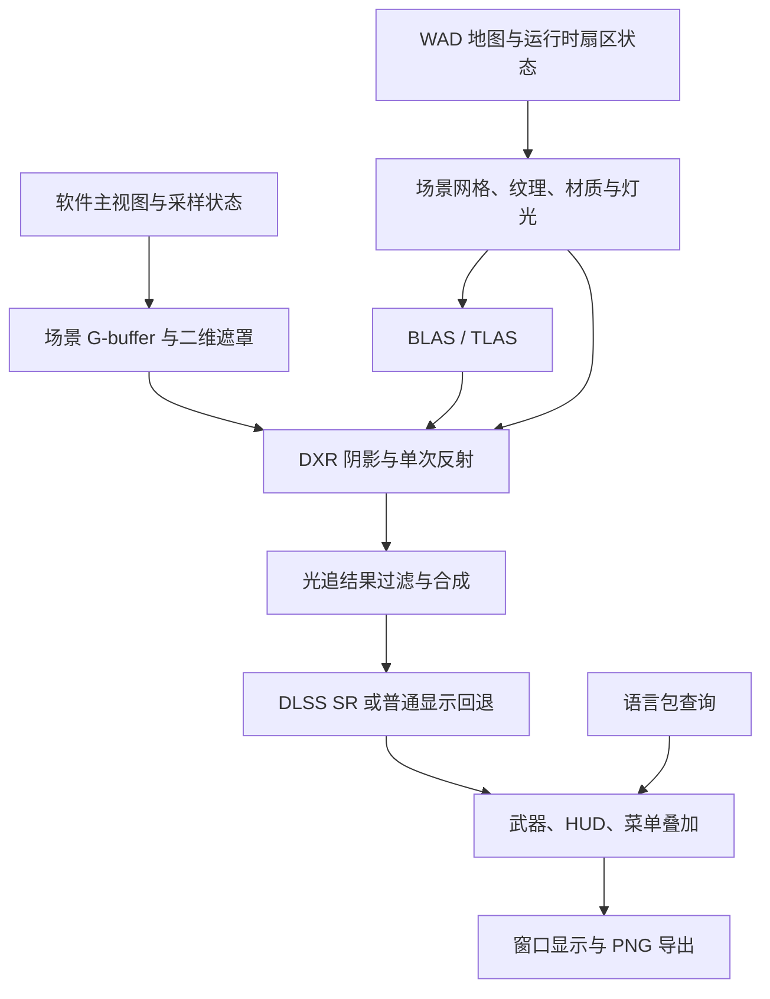

# DLSS、NVIDIA 硬件光追与语言包实施方案

日期：2026-10-06。状态：代码审查后的设计方案，尚未实施或实机验证。

## 1. 已确认的范围

- 本轮交付实施方案。
- 超分：沿用现有 NVIDIA NGX，完善 DLSS Super Resolution 的输入、配置与失败回退。
- 光追：在 NVIDIA RTX 显卡上使用 DirectX Raytracing（DXR），首版提供点光源阴影与单次反射。
- 语言包：先实现外部文件、文本查询、语言选择与英文回退；翻译、中文字体与完整本地化放到后续。

DXR 是 DirectX 的硬件光追接口，首版以 NVIDIA RTX 为目标验证硬件；DLSS 通过 NGX 单独检测。两种能力分别开关，不能以 DLSS 可用推断 DXR 可用。

## 2. 现有代码与缺口

以下是静态阅读结论，不代表运行效果已通过验收。

| 功能 | 现状与源码依据 | 实施含义 |
| --- | --- | --- |
| DLSS SR | `win32/ngx_dlss.c` 的 `ngx_create_sr` / `ngx_eval_sr` 已创建并执行 NGX SR | 无需从零接 SDK，主要完善输入与配置 |
| 输入和输出尺寸 | `ngx_create_sr` 固定 320×200 → 1280×800、UltraPerformance；`ngx_log_optimal` 只记录 SDK 查询结果 | 不能只改菜单名称就宣称支持 Quality / Balanced / Performance |
| 时间采样 | NGX 的 jitter 为 0，frame time 固定为 1000/35 ms；FSR2 有自己的相机扰动实现 | 需要统一采样契约，不能直接复制 FSR2 的逻辑就认为正确 |
| G-buffer | `win32/gbuffer.c` 已有线性 view-Z、世界法线、运动矢量；`GB_SetColumn` 丢弃 `kind` | 需要补充材质、表面类别、未照明颜色与二维遮罩 |
| 色彩 | `r_draw.c` 用 COLORMAP 处理纹理；`GB_ConvertColor` 使用经过 gamma 的调色板 | 当前颜色不是物理材质 albedo，不能直接用于再次完整照明 |
| Ray Reconstruction | `ngx_eval_rr` 将画面当 diffuse albedo，使用合成的 specular / roughness | 已有 RR 调用，不等于已有硬件光追；真实 RR 集成应另设里程碑 |
| D3D12 | `i_video_win.c:init_d3d` 对默认适配器创建设备，未检测 DXR；当前每帧 `wait_gpu` | 需要显卡选择、DXR 能力探测、新资源和计时；暂不承诺性能收益 |
| 地图 | `p_setup.c` 加载 vertices / lines / sides / sectors / BSP | 可以提取三维场景，但没有 GPU 三角网格或加速结构 |
| 二维叠加 | `I_FinishUpdate` 单独复制状态栏；其他菜单、武器等仍可能混在 `screens[0]` | 光追与超分需要明确的场景 / 武器 / UI 分层 |
| 语言 | `dstrings.h` 通过编译期开关选语言；`d_englsh.h` 是字符串宏 | 新语言包需要运行时查询，不宜把原宏直接全替换成函数 |
| 菜单与字体 | `m_menu.c:M_Drawer` 绘制 WAD 图片；`hu_lib.c` 按单字节查原版字体 | 外部文本加载本身无法显示中文，也不会自动翻译菜单图片 |

## 3. 技术路线

### 3.1 保留软件主画面，增加 DXR 次级射线

首版采取混合渲染：软件渲染器提供主视图和补齐后的 G-buffer，DXR 对场景几何发射阴影及反射射线，再将结果送入 DLSS SR。这样可以先实现真实的屏幕外反射，无需首轮重写完整主视图渲染器。



首版保留 320×200 场景分辨率。若 SDK 查询或实际创建表明该输入尺寸不被支持，则关闭该组合并记录原因，不能静默把放大的颜色当作新增真实细节。

完整 DLSS 质量档位需要可变场景分辨率。建议后续新增 GPU 主视图渲染路径，共用本方案的场景网格和材质；UI 继续使用 320×200 逻辑坐标。不要直接修改 `SCREENWIDTH` / `SCREENHEIGHT`：字体、状态栏、菜单和软件渲染数组依赖它们。

### 3.2 最小模块接口

以下名称是拟议接口，尚不存在。先保持职责集中，不做全项目渲染器重构。

| 模块 | 调用者所需的最小接口 | 内部责任 |
| --- | --- | --- |
| 场景提取 | `Scene_LoadLevel`、`Scene_Update`、`Scene_UnloadLevel` | 地图网格、纹理 UV、材质表、灯光、扇区变化及稳定对象标识 |
| DXR | `RT_Init`、`RT_SetScene`、`RT_Render`、`RT_Shutdown` | 能力探测、加速结构、着色器、过滤、资源同步与失败状态 |
| 帧采样 | 获取本帧采样状态、提交帧、请求历史重置 | 相机、jitter、实际时间间隔、场景尺寸与重置原因 |
| 语言包 | `L_Init`、`L_Get`、`L_Shutdown` | 文件校验、文本查询、英文回退和稳定字符串生命周期 |

`RT_Render` 接收命令列表、G-buffer 与帧状态并返回输出资源和状态。资源所有权及进入 / 退出状态必须明示；上传缓冲和加速结构在 GPU 使用结束前不能释放。

原游戏保持 C。若 DXR 接口实现采用 C++，仅对新模块启用 C++ 并通过 `extern "C"` 调用；不将整个游戏转换成 C++。构建开关拟为 `WINDOOM_DXR`，可与 `WINDOOM_NGX` 组合。现有 NGX / FSR2 / Anime4K 的互斥关系首版继续沿用。

## 4. DLSS 首版工作

1. 复用现有 NGX SDK 获取与 DLL 部署，保留预设 K / L 的选择。预设选择与质量档位分别配置；当前文件夹名称不是功能可用性的证据。
2. 将宽高、jitter、frame time 和 reset 纳入同一帧状态。正常运行使用实际帧间隔；固定 tic 的 PNG 导出保留 35 Hz 时间线。
3. 渲染时使用的采样位置必须与上传的深度、法线及 NGX jitter 一致。现有 FSR2 会在主视图绘制后恢复相机，不能拿恢复后的参数解释被扰动的 G-buffer。
4. 以当前到上一帧的像素位移为运动矢量契约，明确是否剔除 jitter；校验符号、单位、视窗偏移和静止画面。动态扇区和物体变化需要相应运动信息或局部历史失效。
5. 切关、传送、读档、重开图像效果、尺寸变化和场景 / 菜单切换触发历史重置；暂停时明确是否复用帧，避免不断积累错误历史。
6. 武器、HUD、菜单不进入光追的表面重建，也尽量在超分后叠加。场景遮挡区采用明确的遮罩和边缘处理，不能让二维像素制造假深度。
7. NGX 初始化 / 创建 / 执行失败均记录原因并进入普通显示路径。若 RT 已成功，回退仍要显示合成后的 RT 颜色，不能退回旧 CPU 颜色丢失效果。

首版验收：相同 demo 可比较 DLSS 开关；静止与转身无明显输入错位；HUD 清晰；所有失败路径能够继续显示；日志能说明实际使用了哪个路径。具体画质与性能必须在 RTX 实机上判断。

## 5. NVIDIA DXR 阴影与反射

### 5.1 硬件与工具链

- 枚举适配器；用户指定显卡优先，自动模式优先满足需求的 NVIDIA 适配器。记录显卡、驱动和 DXR 能力。
- 建议首版使用 DXR 1.1 的 inline ray tracing（`RayQuery`）与 compute shader，避免首轮引入 shader binding table。
- 检查 `D3D12_FEATURE_D3D12_OPTIONS5` 的 `RaytracingTier`、Shader Model 6.5 及所需 D3D12 接口；没有能力则关闭 RT。
- 新增 DXC 编译步骤和编译期着色器产物；现有 Anime4K 使用的 `d3dcompiler` 不能替代该步骤。Windows SDK 与 DXC 版本在能力探测阶段确定并固定。
- RTX 型号及驱动要求以实机能力与所选 SDK 的查询结果为准；不预先承诺最低显卡型号或帧率。

### 5.2 场景网格与加速结构

- 从单面墙、双面墙高度差、masked midtexture、地板和天花板生成几何。沿用 WAD 纹理偏移、重复与 pegging 规则，提供命中点 UV。
- 地板 / 天花板按 BSP 叶子的真实闭合区域生成三角形。原始 subsector 的 seg 列表不一定包含完整闭合边界，不能直接盲目作三角扇；需沿 BSP 分割平面裁剪出区域并校验。
- sky 单独处理，不能生成封闭天空的实体墙面。透明栅栏等用 alpha 判断候选命中，不得把透明像素变成遮挡。
- 静态几何构建 BLAS；门、升降机、移动地板所属几何分组更新。一个扇区高度变化会改变相邻墙面的上下区域，相关墙面必须一起更新。
- 保持动态几何拓扑稳定时可使用允许更新的 BLAS；无法保持拓扑时重建受影响分组。TLAS 同步更新，加入 barrier 与生命周期管理。
- 在 `P_SetupLevel` 释放 `PU_LEVEL` 旧地图数据之前卸载场景；新地图加载完成后建立新场景。不得保存跨关卡失效的地图指针。
- DOOM 地图是 X/Y 水平、Z 向上，而当前 G-buffer 法线按 Y 向上编码。统一转换位置、法线、相机、灯光、UV 朝向与三角形绕序。

### 5.3 材质与灯光

- 新增未照明 albedo、材质 ID、表面类别与有效场景遮罩。未照明颜色来自 COLORMAP 之前的纹理索引和基础调色板，不从最终屏幕颜色反推。
- 以 WAD 纹理 / flat 名称匹配外部材质参数：roughness、specular、emissive、反射开关。默认多数表面不反射，避免整关卡突然变成镜面。
- 原版 `sector.lightlevel` 可作为环境亮度基线，并随运行时变化；它没有光源位置。首版显式配置测试点光源，再补少量灯具 / 火把规则，不把每个亮扇区自动当点光源。
- 在明确的线性色彩空间计算新增照明与反射，再处理色调、gamma 和原版受伤 / 拾取调色板效果。明确旧光照与新光照的合成规则，避免重复照明。

### 5.4 阴影和反射的首版边界

- 阴影：点光源到可见表面发射有距离上限的遮挡射线；每像素选择有限数量的灯光。先以硬阴影验证正确性。
- 反射：仅对选定材质发射一次反射射线；命中后使用场景纹理、UV、基础照明和自发光着色；miss 使用天空 / 环境颜色。可反射屏幕外几何。
- 不使用当前屏幕颜色作为反射命中颜色来源。单次反射不再递归反射；如命中点需要阴影，额外阴影射线也纳入预算。
- 首版反射内容包含地图和动态门 / 平台。怪物、物品等 sprite 的反射与投影列为后续阶段；游戏主画面的 sprite 继续保留，并应通过遮罩避免被误当反射表面。
- 首先交付稳定的镜面 / 低粗糙度反射。随机粗糙反射或软阴影在加入深度 / 法线 / 材质拒绝、历史过滤和去噪后再开放。
- 反射运动与主表面运动不同，不能仅靠主视图运动矢量保证反射历史稳定。首版避免跨不可靠命中积累，后续增加命中信息及相应重投影。

首版暂不包括完整路径追踪、全局光照、多次反射、Frame Generation 或 RR 的真实材质集成。RR 后续使用对应 SDK 要求的真实 albedo、roughness、法线、命中距离等输入，并单独验收；不能简单替换现在的合成纹理就宣称完成。

## 6. 语言包框架

### 6.1 文件与查询约定

建议使用 UTF-8 的受限 INI 格式，由一个小型解析模块负责；不在原游戏中引入大型配置库。示例是将来格式，尚不可直接运行：

```ini
# languages/en-US.ini
[meta]
schema = 1
id = en-US
name = English

[strings]
menu.new_game = New Game
menu.options = Options
message.picked_armor = Picked up the armor.
prompt.quit = Are you sure you want to quit?\nPress Y or N.
```

- 使用稳定键，不用英文原句作键。内建英文目录作为最终回退；不存在的键回退英文并记录一次。
- 支持注释、BOM、CRLF、`\n`、`\\`，限制文件大小与单值长度；拒绝重复键、非法 UTF-8 和不支持的 schema。解析完整成功后才发布目录，错误包整体回退。
- 拟议配置为 `language = en-US`，拟议启动参数为 `-lang en-US`。优先级：启动参数 > 已保存设置 > 英文；文件从明确的程序资源目录查找，不依赖启动工作目录。
- 首版在启动时选择语言，切换后重启生效。查询返回只读字符串，生命周期直到 `L_Shutdown`；适配旧 `char *message` 接口时保证不修改目录文本。
- 不直接把 `d_englsh.h` 的所有宏改成 `L_Get`：部分宏用于静态数组初始化和字符串字面量拼接。保留英文目录，逐处将消费者迁移为运行时查询。
- `%s` 等动态参数使用已定义的模板键和受限格式替换；校验参数数量与类型，不能把外部语言文本直接当任意 `printf` 格式串。

### 6.2 首版接入范围与字体限制

首版实际接入退出提示、选项开关提示、拾取提示，以及新增图形设置文字；至少提供一个使用现有字体字符的示例包，证明替换生效。其余文本建立键清单，后续逐处迁移。

菜单原有 `M_*` 图片需要明确的文字绘制入口：保留图片名称作为默认资源，为可本地化项增加文本键；对应项选择文本绘制，其余按原资源绘制。帮助页、标题图、剧情图与资源替换不在本阶段。

UTF-8 的保存 / 校验能力与字形显示能力分别验收。首版原版字体只能显示已有字符；语言元信息预留可选字体标识，未提供所需字形时明确报告显示限制并回退可显示文字。后续接入 Unicode 解码、字形加载、测量、换行与字形回退后，再交付中文。聊天输入和存档名称输入也单独处理。

迁移文本时同步替换 `m_menu.c:M_Drawer` 等位置的固定长度临时缓冲和无界复制，保证较长译文能安全截断 / 换行；ASCII 大小写操作不得直接逐字节处理 UTF-8。

首版验收：无需重新编译即可加载示例包；缺键和坏包可回退；启动选择可持久化；旧包版本不匹配有明确诊断；尚未迁移的文字与字体限制有记录。

## 7. 实施顺序与交付门槛

| 阶段 | 交付内容 | 完成门槛 |
| --- | --- | --- |
| P0：基线与能力 | Windows 构建、GPU / DXR / NGX 能力日志、固定 demo、GPU 时间戳 | 原版和现有 SR 能运行；知道实际 GPU、驱动与 SDK 支持情况 |
| P1：帧数据 | 一致的采样状态、补齐 G-buffer、场景 / 二维分层、重置规则 | 深度与法线对齐；已知移动方向的矢量正确；菜单 / 武器不参与场景光追 |
| P2：语言框架 | 文件解析、英文目录、示例包、启动选择、首批调用迁移 | 外部包实际替换文本；错误和缺键回退；字符串寿命与长度处理正确 |
| P3：DXR 阴影 | 地图网格、材质、BLAS / TLAS、一个显式点光源 | 实体墙遮挡正确；门打开后阴影更新；透明和天空按规则处理 |
| P4：DXR 反射 | 指定材质、单次反射、命中纹理与基本过滤 | 镜面能看到屏幕外地图；门 / 平台同步更新；受预算约束 |
| P5：组合交付 | RT 合成接 SR、配置与部署、失败回退、对比导出 | RT+SR 组合运行；关闭 DLSS 仍显示 RT；失败回退可继续游戏 |
| P6：后续扩展 | GPU 主视图、真实质量档位、sprite 光追、粗糙反射、RR、中文字体 | 每项各自定义并走实机验收，按优先级选做 |

P2 可独立推进，不依赖 DXR；P3、P4 和 P5 依赖 P1 的正确帧数据。优先 P0 是为了在大规模修改前确认硬件与现有 SDK 路径，不能把尚未运行的功能当作基线。

## 8. 预计改动位置

- `CMakeLists.txt`、`build.cmd`、`play-windoom.cmd`：DXR 编译开关、DXC 产物、组合启动与语言资源部署。
- `win32/i_video_win.c`：适配器、能力检测、RT 到 SR 的调度、二维叠加与回退；具体 DXR 实现放新模块。
- `win32/ngx_dlss.c/.h`、`win32/fsr2.c/.h`、拟新增帧采样模块：显式帧参数与历史契约。
- `win32/gbuffer.c/.h`、`linuxdoom-1.10/r_draw.c`、`r_segs.c`、`r_plane.c`、`r_things.c`：表面属性、未照明颜色、二维遮罩与数据一致性。
- 拟新增 `win32/rt_scene.c/.h`、`win32/rt_dxr.cpp/.h`、`win32/shaders/rt/`：地图提取、加速结构、射线着色与过滤。
- `linuxdoom-1.10/p_setup.c` 及扇区运行状态：场景加载 / 卸载和动态更新；优先集中扫描变化，必要时再加变更标记。
- 拟新增语言模块、`languages/`、`dstrings.c/.h`、`m_misc.c`、`m_menu.c`、`hu_lib.c`、`hu_stuff.c`、`p_inter.c`：文本目录、选择、首批消费者和绘制适配。
- 新材质 / 灯光配置：随示例地图提供参数，不硬编码到原游戏玩法逻辑。

## 9. 后续验证安排与未决项

已读取用户指定的 runner 配置：有 Windows runner `fengge`。本轮没有执行远程命令、构建或运行游戏；尚未知其 GPU、驱动、Windows SDK、DXC、交互桌面及 IWAD 是否就绪。

实施时使用配置中提供的 runner CLI，通过其 `exec` / `upload` / `download` 操作，不把凭据拼到命令参数。使用独立工作目录保存构建与截图；能够远程构建并不等于能够在交互桌面运行和验证 RTX 画面。

验证矩阵至少包括：原版；SR；RT 阴影；RT 阴影+反射；RT+SR；无 DXR；无 NGX；初始化或执行失败；调试视图；PNG 导出；语言包正常 / 缺键 / 损坏。同一 demo 在不同路径运行，分别比较画面、GPU 各阶段时间和显存占用。

重点场景：静止与转身、传送、开关门、升降机、透明栅栏、天空、窗口化失焦、菜单 / 武器 / HUD、读档与换关、反射屏幕外物体，以及长文本。射线预算初始采用有限灯光和每个反射像素一次反射；根据实测调整，不预先给出 FPS 保证。

开始 P0 后确定：实际 RTX 型号、目标输出分辨率、NGX 接受的输入尺寸、可用测试 IWAD / demo、示例反射材质与点光源、Windows 工具链版本。估时在 P0 与地图提取试做后给出；几何闭合、动态扇区更新及反射着色是主要工作量。
